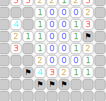

# HTML Games

This repository contains my implementations of classic games for web
browsers. [Click here](https://akuli.github.io/html-games/) to play.

Here are some screenshots:

## Developing the games

Clone the repository and run `server.py` with Python 3. Then go to
`localhost:8000` with your browser.

To lint the javascript code, install node and npm, and run these commands:

    npm install
    node_modules/eslint/bin/eslint.js js
